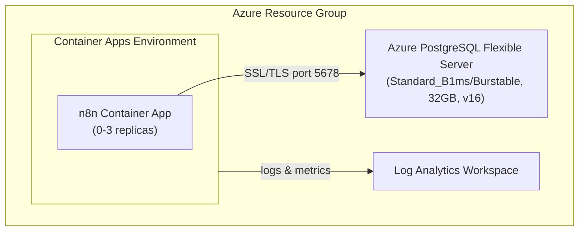

# n8n Azure Configuration Skill

Application-specific configuration for deploying n8n to Azure Container Apps with PostgreSQL. Infrastructure should be generated fresh by the `azure-prepare` → `azure-validate` → `azure-deploy` pipeline.

## Prerequisites and Portability

Require Azure CLI, Azure Developer CLI 1.28.0 or later, and Node.js 24 LTS or later. Generated lifecycle hooks must be JavaScript (`.mjs`) or TypeScript (`.ts`) files referenced directly from `azure.yaml`; do not generate Bash-only `.sh` or PowerShell-only `.ps1` hooks. See `../../../docs/tool-installation.md` for Windows, macOS, and Linux installation options.

## Critical: Subscription Context

**ALWAYS set AZURE_SUBSCRIPTION_ID explicitly before running `azd up`.** Read it with `az account show --query id -o tsv`, then pass the returned value to `azd env set AZURE_SUBSCRIPTION_ID <subscription-id>`. Do not emit Bash command substitution when the operating system is unknown.

## Critical: PostgreSQL AVM Defaults

**📖 See [../config/postgresql-avm-defaults.md](../config/postgresql-avm-defaults.md) for all PostgreSQL AVM gotchas** (publicNetworkAccess, passwordAuth, HA, password pinning). Without these settings, n8n will fail with "authentication failed" or "connection timeout".

**n8n-specific:** Pin `POSTGRES_PASSWORD` and `N8N_ENCRYPTION_KEY` in the azd environment so redeployments keep the same values. Generate both with Node's `crypto.randomBytes()` or another cryptographically secure platform API. Do not require `openssl`, and do not create `N8N_AUTH_PASSWORD`; current n8n releases use built-in owner-account management rather than the removed `N8N_BASIC_AUTH_*` variables.

## Critical: PostgreSQL SKU Format

```bicep
sku: { name: 'Standard_B1ms', tier: 'Burstable' }  // Both fields required
```

## Official Documentation

- n8n Docker Installation: https://docs.n8n.io/hosting/installation/docker/
- n8n Environment Variables: https://docs.n8n.io/hosting/configuration/environment-variables/

## Quick Start (Verified)

```text
# 1. Register providers (one-time per subscription)
az provider register --namespace Microsoft.App
az provider register --namespace Microsoft.DBforPostgreSQL
az provider register --namespace Microsoft.OperationalInsights

# 2. Create environment
azd env new my-n8n-env

# 3. Set required variables (replace placeholders with collected/generated values)
azd env set AZURE_SUBSCRIPTION_ID "<subscription-id>"
azd env set AZURE_LOCATION "westus"
azd env set POSTGRES_PASSWORD "<generated-secret>"
azd env set N8N_ENCRYPTION_KEY "<generated-secret>"

# 4. Deploy (~7-10 minutes)
azd up

# 5. Access n8n
azd env get-value N8N_URL
# First launch: complete the Set up owner account flow
```

**Deployment time breakdown:**
- Resource Group: ~4s
- Log Analytics: ~25s
- Container Apps Environment: ~38s
- PostgreSQL Flexible Server: ~4-5 min
- n8n Container App: ~20s
- **Total: ~7 minutes**

## Key Configuration Files

| File | Purpose |
|------|---------|
| `config/environment-variables.md` | All n8n environment variables for Azure |
| `config/health-probes.md` | Health probe timing for n8n startup |
| `troubleshooting.md` | Common issues and solutions |

## Architecture



## n8n-Specific Requirements

### Container Configuration

| Setting | Value | Reason |
|---------|-------|--------|
| Image | `docker.io/n8nio/n8n:2.30.6` | Pin a tested official image; never use `latest` |
| Port | 5678 | n8n default port |
| CPU | 1.0 cores | Minimum for responsive UI |
| Memory | 2Gi | n8n recommended minimum |
| Min Replicas | 1 in CI, 0 after validation | CI needs deterministic readiness; scale-to-zero is fine for demos/cost after tests pass |
| Max Replicas | 3 | Handle traffic spikes |

### Health Probes (CRITICAL)

n8n requires **60+ seconds** to start. See `config/health-probes.md`.

**Without proper health probes, containers will crash before n8n initializes!**

Use the dedicated health endpoint `/healthz` for startup, readiness, and liveness probes. Do not probe `/`; the UI root can redirect or stall while the app is still initializing. When using the AVM Container App module, use `startup.failureThreshold: 10` with `startup.periodSeconds: 30` for a five-minute startup window, because AVM caps `failureThreshold` at 10.

### Database Requirements

- PostgreSQL 15 or 16 (Flexible Server)
- SSL enabled (required by Azure)
- FQDN connection (not internal hostname)

## Cost Estimate (Dev Environment)

| Resource | Monthly Cost |
|----------|--------------|
| Container Apps (scale-to-zero) | ~$5-15 |
| PostgreSQL Flexible Server | ~$15 |
| Log Analytics | ~$2-5 |
| **Total** | **~$25-35/month** |

## Verification

After `azd up`, run the verification commands in [troubleshooting.md](troubleshooting.md). Key checks: HTTP 200 from `$N8N_URL/healthz`, HTTP 200 from the n8n UI URL, the owner-setup or login page renders, `WEBHOOK_URL` is set on the container, and container logs show no errors. In CI, poll `/healthz` for up to 5 minutes before checking the UI.

## Cross-Platform Post-Provision Hook

Generate `infra-n8n/hooks/postprovision.js` and reference it directly from `azure.yaml`:

```yaml
hooks:
  postprovision:
    run: ./infra-n8n/hooks/postprovision.js
```

The hook must use `child_process.execFileSync()` or `spawnSync()` with argument arrays to call `azd` and `az`; it must not assemble shell command strings. Read the Container App FQDN, set `WEBHOOK_URL=https://<fqdn>`, and fail with a nonzero exit code if either CLI call fails. This works natively on Windows, macOS, and Linux.

## Tear Down

```bash
azd down --force --purge
```

**Note:** Teardown takes 5-10 minutes (PostgreSQL deletion is slow).

## n8n-Specific Quirks

1. **Slow startup** — needs 60s+ `initialDelaySeconds` on liveness probe and a five-minute startup window
2. **SSL** — requires `SSL_REJECT_UNAUTHORIZED=false` for Azure PostgreSQL
3. **WEBHOOK_URL** — set post-deployment via hook (circular dependency with FQDN)
4. **Port 5678** — non-standard port for health checks and ingress
5. **PostgreSQL AVM defaults** — see [../config/postgresql-avm-defaults.md](../config/postgresql-avm-defaults.md)
6. **CI health checks** — set `minReplicas: 1`, probe `/healthz`, and wait for health before UI checks
7. **AVM probe failureThreshold cap** — capped at 10; use `periodSeconds: 30` with `failureThreshold: 10` for 5 min window

## Azure MCP Tools

Use these Azure MCP Server tools for n8n deployments:

| Tool | When to Use |
|------|-------------|
| `azure_bicep_schema` | Get latest schemas for `Microsoft.App/containerApps` and `Microsoft.DBforPostgreSQL/flexibleServers` |
| `azure_deploy_architecture` | Generate Mermaid architecture diagrams for the n8n deployment |
| `azure_deploy_plan` | Validate the deployment plan before `azd up` — use `target=ContainerApp` |
| `azure_deploy_app_logs` | Fetch container logs from Log Analytics when troubleshooting startup or connectivity issues |

## Reproducibility Notes

This deployment has been tested multiple times and is verified working:
- ✅ Clean environment deployment
- ✅ Teardown and redeploy
- ✅ Parameter interpolation via `${VAR}` syntax in main.parameters.json
- ✅ Post-provision hook correctly sets WEBHOOK_URL
