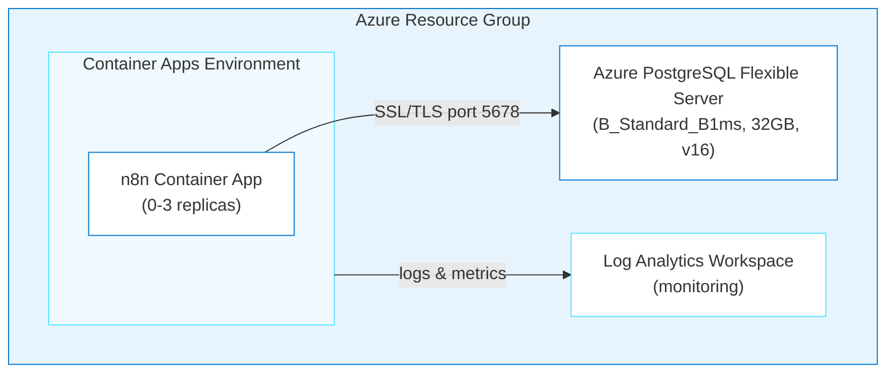

# n8n on Azure Container Apps

> ✨ **Deploy a self-hosted workflow automation platform to Azure by having a conversation with an AI agent.**

<p align="center">
  
</p>

Want workflow automation on Azure but don't want to write Bicep (Azure's infrastructure-as-code language)? Tell an AI agent what you want, and it generates the infrastructure, configures health probes, and deploys it. You'll have [n8n](https://n8n.io), an open-source workflow automation tool (like Zapier, but self-hosted), running on Container Apps with PostgreSQL in about 20–30 minutes.

## Learning Objectives

- Use the `oss-to-azure-deployer` agent with GitHub Copilot to generate Azure infrastructure through conversation
- Understand how the agent loads app-specific and generic skills to build Bicep templates
- Deploy n8n to Azure Container Apps with PostgreSQL using `azd up`
- Configure health probes for slow-starting containers
- Troubleshoot common deployment issues using Azure MCP (Model Context Protocol) tools and container logs

> ⏱️ **Estimated Time**: ~20–30 minutes first run (Postgres provision dominates)
>
> 💰 **Estimated Cost**: ~$25–35/month **if left running** (see [Cost Breakdown](#cost-breakdown)). **Tear down the same day with `azd down --force --purge`.**
>
> 📋 **Prerequisites**
>
> - Azure CLI, Azure Developer CLI 1.28.0+, and an agentic coding tool
> - Node.js 24 LTS or later for the cross-platform post-provision hook
> - An Azure subscription with permission to create Container Apps and PostgreSQL Flexible Server
>
> See the [cross-platform installation guide](../../docs/tool-installation.md) for Windows, macOS, and Linux installation and verification commands.

> [!NOTE]
> Use [GitHub Copilot CLI](https://github.com/features/copilot/cli), the [GitHub Copilot app](https://github.com/features/ai/github-app), or another agentic coding tool. For other tools, run: **"Copy or adapt this repository's `.github/skills` into your supported skills or instructions location, preserving their behavior and reporting anything unsupported."**

### Done when

- [ ] `$N8N_URL/healthz` returns HTTP 200
- [ ] UI loads (HTTP 200); title contains n8n and the owner-setup or login page renders
- [ ] `WEBHOOK_URL` set on the container (agent or post-provision hook)
- [ ] `azd down --force --purge` completed

---

## Architecture



**Azure resources created:**

- **Azure Container Apps**: Serverless hosting with scale-to-zero
- **Azure Database for PostgreSQL Flexible Server**: Managed database for persistent storage
- **Azure Log Analytics**: Centralized monitoring and logging
- **User-Assigned Managed Identity**: Secure access to Azure resources

**Infrastructure directory:** `infra-n8n/` (generated at the repo root when you run the deployment. It won't exist until then)

---

## Deploy with the Agent

You'll use `oss-to-azure-deployer` (a custom agent defined in this repo) with GitHub Copilot to generate and deploy the entire infrastructure through conversation.

> **💡 Tip: Track issues as you go.** When giving GitHub Copilot a prompt, add *"If you encounter any issues, log them to issues.md so they can be tracked and fixed."* This gives GitHub Copilot a place to record problems it finds or fixes during generation, making it easier to iterate and debug.

### Step 1: Setup

Make sure you're in the repo root first:

```bash
cd github-azure-agentic-journeys
```

Then start GitHub Copilot. Examples use the [GitHub Copilot CLI](https://docs.github.com/en/copilot/how-tos/copilot-cli/cli-getting-started); the app and VS Code agent chat work the same — type the prompts without the leading `>`:

```bash
copilot
```

If you haven't installed the Azure Skills plugin yet, do it now — it's a one-time setup that adds deployment tools, Bicep schema lookups, and infrastructure generation (details in the root [Quick Start](../../README.md#quick-start)):

```
> /plugin marketplace add microsoft/azure-skills
> /plugin install azure@azure-skills
```

Now select the deployment agent. Agents are specialized personas that know how to handle specific tasks:

```
> /agent
```

Select **`oss-to-azure-deployer`** from the list. You're now in an interactive session with the deployment agent.

### Step 2: Deploy

<p align="center">
  
</p>

Tell the agent what you want in a single prompt (OSS shared recipe: location + secrets + probes + resolve issues):

```
> Deploy n8n to Azure using Bicep and azd. Set the location to westus,
  generate secure passwords for all credentials, set the Container App
  minReplicas to 1 so I can verify it right away without a cold start,
  use n8n's /healthz endpoint for startup/readiness/liveness probes,
  resolve any issues that come up, and log problems to issues.md.
```

The deployment takes several minutes. You'll see the agent generating Bicep files, registering Azure providers, and running `azd up`. It may prompt you to confirm your Azure subscription.

> ⏳ **While you wait:** The agent is provisioning your infrastructure. Here are some things to do while it runs:
>
> 1. Watch your resources appear in real-time. Open the [Azure Portal](https://portal.azure.com) → search for your resource group (`rg-<env-name>`), or run `az resource list --resource-group rg-<env-name> --output table` in a separate terminal.
> 2. Look at the [architecture diagram](#architecture) above. Match each box to a resource appearing in the portal.
> 3. Ask the agent: *"What's happening right now? Walk me through the deployment step by step."*
> 4. **Quiz yourself:** Why does n8n need an approximately five-minute startup window (`failureThreshold: 10` with `periodSeconds: 30`)? (Hint: expand the collapsed **Configuration Reference** section below and check the Health Probes table.)
> 5. Browse the [n8n workflow templates](https://n8n.io/workflows/) and pick one you want to try after deployment.

The agent handles the entire deployment:

1. Loads the `n8n-azure` and `container-apps-deployment` skills, then follows the Azure plugin pipeline: `azure-prepare` → `azure-validate` → `azure-deploy`
2. Uses Azure MCP tools to look up Bicep schemas and best practices
3. Generates modular Bicep infrastructure in `infra-n8n/`
4. Updates `azure.yaml`, registers Azure providers, sets environment variables
5. Runs `azd up`
6. Configures `WEBHOOK_URL` with `infra-n8n/hooks/postprovision.js`, referenced directly from `azure.yaml`. The JavaScript hook uses Node.js and works on Windows, macOS, and Linux without Bash or PowerShell-specific syntax.

You can ask follow-up questions anytime during or after generation:

```
> Why did you set the liveness probe to 60 seconds?
> What does the post-provision hook do?
```

### Step 3: Verify

Ask the agent to confirm everything is working:

```
> Verify the n8n deployment is working. Check the health endpoint and container logs.
```

The agent uses `azure_deploy_app_logs` (an Azure MCP tool that fetches container logs) to confirm the deployment is healthy.

Generate `scripts/verify-n8n.mjs` and run it with `node scripts/verify-n8n.mjs`. The portable verifier must read `N8N_URL` through `azd`, poll `/healthz` for HTTP 200, require HTTP 200 from the UI, and use Playwright's bundled Chromium to assert the rendered page is either **Set up owner account** or the normal n8n login screen. HTTP 401 is not an acceptable substitute for this check.

If something goes wrong, just ask. You're still in the same session with full context:

```
> The container is in CrashLoopBackOff, what's happening?
```

For a more detailed checklist, see the troubleshooting section.

---

<details>
<summary>Configuration Reference (handled by the agent automatically)</summary>

## Configuration Reference

### Environment Variables

The deployment automatically configures these n8n environment variables:

| Variable | Value | Description |
|----------|-------|-------------|
| `DB_TYPE` | `postgresdb` | Database type |
| `DB_POSTGRESDB_HOST` | Azure PostgreSQL FQDN | Database server address |
| `DB_POSTGRESDB_PORT` | `5432` | PostgreSQL port |
| `DB_POSTGRESDB_DATABASE` | `n8n` | Database name |
| `DB_POSTGRESDB_SSL_ENABLED` | `true` | Required for Azure PostgreSQL |
| `DB_POSTGRESDB_SSL_REJECT_UNAUTHORIZED` | `false` | Azure cert compatibility |
| `DB_POSTGRESDB_CONNECTION_TIMEOUT` | `60000` | 60s timeout for cold starts |
| `N8N_ENCRYPTION_KEY` | Auto-generated | Encryption key for credentials |
| `N8N_PORT` | `5678` | n8n default port |
| `N8N_PROTOCOL` | `https` | Protocol for generated URLs |
| `N8N_ENDPOINT_HEALTH` | `healthz` | Dedicated health endpoint for probes |
| `WEBHOOK_URL` | Auto-configured | Set by post-provision hook |

### Container Resources

| Setting | Value |
|---------|-------|
| Image | `docker.io/n8nio/n8n:2.30.6` |
| CPU | 1.0 core |
| Memory | 2 GiB |
| Min Replicas | 1 while verifying the deployment; 0 afterward if you want scale-to-zero |
| Max Replicas | 3 |
| Scale Rule | HTTP requests (10 concurrent per replica) |

### Health Probes

n8n requires **60+ seconds** to start. Without proper health probes, Azure kills the container before initialization completes.

| Probe | Initial Delay | Period | Failure Threshold | Max Wait |
|-------|---------------|--------|-------------------|----------|
| Startup | n/a | 30s | 10 | 5 minutes |
| Liveness | 60s | 30s | 3 | n/a |
| Readiness | n/a | 10s | 3 | n/a |

Probe path: `/healthz`. Don't probe `/`; that's the UI root and can redirect or hang while n8n is still initializing.

### Secrets Management

Sensitive values are stored as Container App secrets and referenced via `secretRef`:

- `postgres-password` → `DB_POSTGRESDB_PASSWORD`
- `n8n-encryption-key` → `N8N_ENCRYPTION_KEY`

Current n8n releases use built-in user management. On first launch, complete the **Set up owner account** flow. Do not generate or configure the removed `N8N_BASIC_AUTH_*` variables.

---

## Cost Breakdown

| Resource | SKU | Monthly Cost |
|----------|-----|--------------|
| Container Apps (scale-to-zero) | Consumption (1 vCPU, 2GB) | ~$5-15 |
| PostgreSQL Flexible Server | B_Standard_B1ms (32GB) | ~$15 |
| Log Analytics | Pay-per-GB (30-day retention) | ~$2-5 |
| **Total** | | **~$25-35/month** |

Scale-to-zero keeps costs low during idle periods. For production with `minReplicas: 1`, expect ~$60-80/month for Container Apps alone.

</details>

---

<details>
<summary>Troubleshooting</summary>

## Troubleshooting

### Container CrashLoopBackOff

**Symptom:** Container restarts repeatedly, logs show health check failures.

**Cause:** n8n needs 60+ seconds to start, and default health probes kill it too early.

**Fix:** Ensure health probes target `/healthz`, use `initialDelaySeconds: 60` on liveness, and use a five-minute startup window. With the AVM Container App module, that means `failureThreshold: 10` with `periodSeconds: 30`. Keep `minReplicas: 1` until the health check passes.

Ask the agent to diagnose:

```
> My n8n container keeps restarting. Check the logs and tell me what's wrong.
```

The agent uses `azure_deploy_app_logs` to pull logs and identify the issue.

### Database Connection Refused

**Symptom:** n8n logs show `ECONNREFUSED` or SSL handshake errors.

**Fix:**
1. Always use PostgreSQL **FQDN** (not internal hostname)
2. Enable SSL: `DB_POSTGRESDB_SSL_ENABLED=true`
3. Set `DB_POSTGRESDB_SSL_REJECT_UNAUTHORIZED=false` (Azure cert compatibility)
4. Increase connection timeout to 60s for cold starts

### WEBHOOK_URL Not Set

**Symptom:** Webhooks don't work, static assets fail to load.

**Cause:** Circular dependency: the FQDN isn't known until Container App is created.

**Fix:** The post-provision hook handles this automatically. If it wasn't set, ask the agent:

```
> The WEBHOOK_URL isn't set on my n8n container. Fix it using the container's FQDN.
```

### Resource Provider 409 Conflicts

**Fix:** Register providers before deployment:

```bash
az provider register --namespace Microsoft.App
az provider register --namespace Microsoft.DBforPostgreSQL
az provider register --namespace Microsoft.OperationalInsights
```

### newGuid() Bicep Error

`newGuid()` can only be used as a **parameter default value**:

```bicep
// ❌ Wrong
var encryptionKey = newGuid()

// ✅ Correct
@secure()
param n8nEncryptionKey string = newGuid()
```

</details>

---

## Cleanup

```bash
azd down --force --purge
```

Teardown takes 3-5 minutes (PostgreSQL deletion is slow). This permanently deletes all data. Export workflows first.

---

## Key Learnings

- **Post-provision hooks** solve circular dependencies (like WEBHOOK_URL needing the deployed URL)
- **Azure MCP tools** give the agent real-time access to Bicep schemas. It's looking up actual API versions, not guessing.
- **Register providers first.** This prevents 409 conflicts during deployment.
- **Same agent, different skills.** The agent loaded `n8n-azure` and adapted to n8n's specific requirements automatically.

---

## Assignment

1. Ask the agent: *"How would I add a custom domain to my n8n deployment?"*
2. Create a simple workflow in n8n: add an HTTP Request node that calls `https://api.github.com/zen`, connect it to a Set node, and run it. This confirms your deployed n8n instance can make outbound API calls.
3. Clean up with `azd down --force --purge`

---

## What's Next

Explore the other journeys:

- [AIMarket](../aimarket/README.md) — full-stack build from a PLAN.md spec with Foundry
- [Superset](../superset/README.md) — AKS, init containers (higher cost)
- [Grafana](../grafana/README.md) — the simplest Container Apps deploy

> 📚 **All journeys:** [Back to root README](../../README.md#agentic-journeys)

---

## Resources

- [n8n Documentation](https://docs.n8n.io/)
- [Azure Container Apps](https://learn.microsoft.com/azure/container-apps/)
- [Azure Database for PostgreSQL](https://learn.microsoft.com/azure/postgresql/)
- [Azure Developer CLI](https://learn.microsoft.com/azure/developer/azure-developer-cli/)
