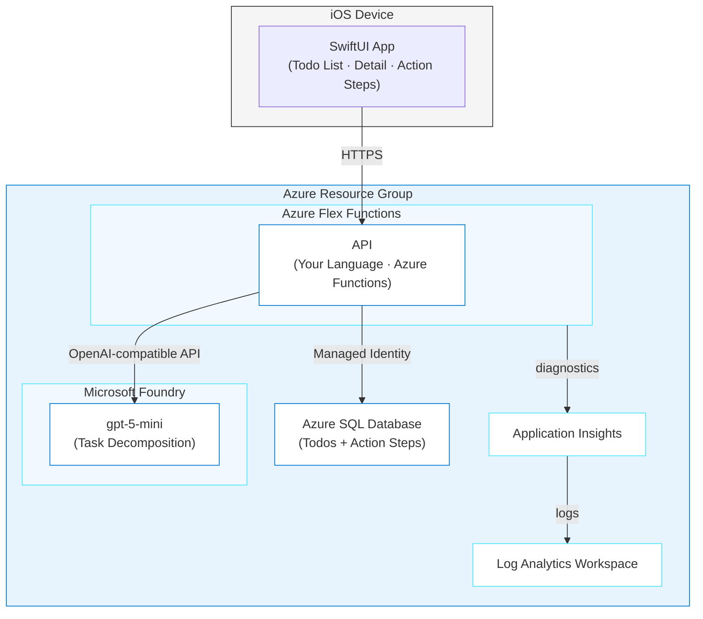

# SmartTodo - AI-Powered Task App

> ✨ **Type a fuzzy goal, get a step-by-step action plan, powered by Azure Functions, Azure SQL, and Microsoft Foundry.**

<p align="center">
  
</p>

You'll build SmartTodo: an iPhone app where you type a todo like "Prepare Conference talk" and AI breaks it into concrete steps you can check off. The backend runs on Azure Functions Flex Consumption, Azure SQL stores the data, and gpt-5-mini on Microsoft Foundry handles the thinking. Pick your language (Node.js, Python, .NET, or Java), hand GitHub Copilot a spec, and it scaffolds the API, generates SwiftUI screens, and deploys the backend to Azure.

## Learning Objectives

- Use a spec document as shared context for GitHub Copilot to scaffold a serverless API and iOS app together
- Build an Azure Functions API in your language of choice with the repository pattern
- Connect Azure Functions to Azure SQL using managed identity, with no passwords in code
- Call gpt-5-mini via Microsoft Foundry to decompose vague goals into actionable steps
- Structure a SwiftUI app that talks to a cloud API with async/await networking
- Deploy the backend to Azure Functions Flex Consumption with `azd` and point the iOS app at the live URL

> ⏱️ **Estimated Time**: **3–5 hours first run** (about 2.5 hours if Functions + SQL are familiar). Includes build, test, deploy, and post-provision SQL steps.
>
> 💰 **Estimated Cost**: ~$10–30/month **if left running** (Functions Flex + SQL Basic + AI pay-per-token; see [Cost Breakdown](#cost-breakdown)). **Tear down the same day with `azd down --force --purge`.**
>
> 📋 **Prerequisites**
>
> - Azure CLI, Azure Developer CLI 1.28.0+, and an agentic coding tool
> - Node.js 24 LTS or later for the cross-platform post-provision hook and default API stack
> - Azure Functions Core Tools v4 for local Functions execution
> - Azurite as a project-local development dependency for local Functions storage when `UseDevelopmentStorage=true`
> - The current Go-based `sqlcmd` for managed-identity database setup
> - Docker if you want to run SQL Server locally in Phase 1
> - The selected API runtime if you choose Python 3.10+, .NET 8+, or Java 17+ instead of Node.js
> - Xcode for the iOS simulator on macOS only
>
> Run `node --version`, `func --version`, and `sqlcmd --version` before starting. The [cross-platform installation guide](../../docs/tool-installation.md) includes Windows, macOS, and Linux options for Functions Core Tools and `sqlcmd`.
>
> ⚠️ **Platform gate:** The full journey, including Phase 2 simulator testing, requires macOS and Xcode. On Windows or Linux, generate and statically verify the SwiftUI source, then complete Phase 1 and Phase 3 and verify the deployed API with HTTP calls. That counts as finishing the Azure path.

> [!NOTE]
> Use [GitHub Copilot CLI](https://github.com/features/copilot/cli), the [GitHub Copilot app](https://github.com/features/ai/github-app), or another agentic coding tool. For other tools, run: **"Copy or adapt this repository's `.github/skills` into your supported skills or instructions location, preserving their behavior and reporting anything unsupported."**

### Done when

- [ ] Local API lists seed todos for `userId=user-1`
- [ ] Create todo + `generate-steps` returns 3–7 steps (with AI credentials)
- [ ] Completing all steps marks the todo `completed` (if tested)
- [ ] Deployed `API_URL` responds; AI generate works in Azure
- [ ] (macOS) Simulator talks to local or Azure API
- [ ] `azd down --force --purge` completed

---

## Architecture



**Azure resources created:**

- **Azure Flex Functions**: Serverless hosting for the API (Flex Consumption plan)
- **Azure SQL Database**: Stores todos and AI-generated action steps
- **Microsoft Foundry** (AIServices): gpt-5-mini for task decomposition
- **Application Insights + Log Analytics**: Monitoring and diagnostics
- **Storage Account**: Required by Functions runtime

---

## The Spec

SmartTodo is driven by a spec document: [`PLAN.md`](./PLAN.md) in this journey folder. It defines the data models, API contracts, AI prompt design, and seed data. You don't need to read the whole thing. GitHub Copilot reads it for you and generates code that matches.

**Core data model (the parts you'll build):**

| Entity | Key Fields | Purpose |
|--------|-----------|---------|
| **Todo** | id, title, status, userId, stepsGenerated | Top-level task entered by the user |
| **ActionStep** | id, todoId, title, description, order, isCompleted | AI-generated sub-task with actionable detail |

**API endpoints you'll generate:**

| Method | Path | Description |
|--------|------|-------------|
| `GET` | `/api/todos` | List todos for a user |
| `POST` | `/api/todos` | Create a new todo |
| `PATCH` | `/api/todos/:id` | Update a todo's title or status |
| `DELETE` | `/api/todos/:id` | Delete a todo and its steps |
| `POST` | `/api/todos/:id/generate-steps` | AI-generate action steps from the todo title |
| `PATCH` | `/api/todos/:id/steps/:stepId` | Toggle a step's completion |

---

## The Journey

SmartTodo is built in three phases, and this README's phases match PLAN.md's phases one-to-one. Phase 1 builds the API + AI with Azure SQL, Phase 2 adds the SwiftUI app (macOS), and Phase 3 deploys the backend to Azure. The [`PLAN.md`](./PLAN.md) spec is your shared context throughout.

**How this journey works:** You won't paste one giant prompt and get a finished app. Instead, you'll build incrementally. Ask GitHub Copilot for a piece, inspect what it generated, test it, fix issues, and then move on. This is how developers actually work with AI: generate → inspect → test → refine.

> **💡 Tip: Track issues as you go.** When giving GitHub Copilot a prompt, add *"If you encounter any issues, log them to issues.md so they can be tracked and fixed."* This gives GitHub Copilot a place to record problems it finds or fixes during generation, making it easier to iterate and debug.

> **Note on the iOS app:** The SwiftUI app runs on your Mac (Simulator) or iPhone. It is NOT deployed by `azd`. Only the Azure backend is. The app points at the deployed API URL via a `Config.swift` file.

### Phase 1: Build the API (~60–90 min first time)

<p align="center">
  
</p>

> **📋 Local database setup:** This API uses Azure SQL. For local development, you have two options:
> 1. **Use a local SQL Server**: This container is AMD64-only. Use it only when Docker's AMD64 emulation is already working; don't install privileged emulation as part of the journey. Set `AZURE_SQL_SERVER=localhost`, `AZURE_SQL_USER=sa`, and a locally generated password in `local.settings.json`.
> 2. **Use Azure SQL directly**: Create a free-tier Azure SQL database in the portal and use its connection details in `local.settings.json`.
>
> On Apple Silicon, Windows ARM64, and Linux ARM64, prefer Azure SQL unless AMD64 container execution has already passed preflight. Phase 3 creates the production Azure SQL instance automatically.

Because the default settings use `AzureWebJobsStorage=UseDevelopmentStorage=true`, start Azurite before `func start`. Install and verify it using the [cross-platform tool guide](../../docs/tool-installation.md#azurite).

You'll build the API in stages, not all at once. Each step teaches a different aspect of working with GitHub Copilot.

#### Step 1: Set up the project

Create a project directory inside the repo so GitHub Copilot can access the skills and agent definitions in `.github/`:

```bash
cd github-azure-agentic-journeys/journeys/smart-todo
```

Start GitHub Copilot. Examples use the [GitHub Copilot CLI](https://docs.github.com/en/copilot/how-tos/copilot-cli/cli-getting-started); the app and VS Code agent chat work the same — type the prompts without the leading `>`:

```bash
copilot
```

If you haven't installed the Azure Skills plugin yet, do it now — it's a one-time setup that adds deployment tools, Bicep schema lookups, and infrastructure generation (details in the root [Quick Start](../../README.md#quick-start)):

```
> /plugin marketplace add microsoft/azure-skills
> /plugin install azure@azure-skills
```

#### Step 2: Generate the data models and data layer

Start with the data models and repository pattern, not the full API. This lets you inspect the generated code before building on top of it. **Generate the project first** — then align `local.settings.json` with the template below.

> **Default stack:** Node.js + TypeScript + Azure Functions v4. Prefer another language? Swap it in the prompt and use PLAN.md’s Choose Your Stack table. Todo `status` values are `pending` | `in_progress` | `completed`.

```
> Read the PLAN.md file in this directory. Create an Azure Functions
  Node.js TypeScript project (v4 programming model) in a src/api/ subdirectory
  (or my chosen stack if I say otherwise). Initialize 
  with host.json, local.settings.json, and language-appropriate config.
  Then create:
  1. Data models for Todo and ActionStep from the Phase 1 spec
     (status values: pending | in_progress | completed)
  2. Repository interfaces (TodoRepository, ActionStepRepository) 
  3. Azure SQL implementation using the appropriate SQL driver for my language
  4. A factory that returns the Azure SQL DataStore
  5. Seed data from the PLAN.md tables with exact IDs
  Log issues to issues.md.
```

After generation, `local.settings.json` should look like this (fill in your values):

```json
{
  "IsEncrypted": false,
  "Values": {
    "AzureWebJobsStorage": "UseDevelopmentStorage=true",
    "FUNCTIONS_WORKER_RUNTIME": "node",
    "AZURE_SQL_SERVER": "localhost",
    "AZURE_SQL_DATABASE": "SmartTodo",
    "AZURE_SQL_USER": "sa",
    "AZURE_SQL_PASSWORD": "YourStrong!Pass123",
    "AZURE_AI_ENDPOINT": "",
    "AZURE_AI_DEPLOYMENT": "gpt-5-mini",
    "AZURE_AI_KEY": ""
  }
}
```

Leave the AI values empty for now. You'll fill them in during Step 4 when you add AI-powered step generation.

**🔍 Inspect what was generated:**

Open the repository interfaces file. Look for:
- Does `TodoRepository` have `getAll(userId)`, `getById(id)`, `create()`, `update()`, `delete()`?
- Does `ActionStepRepository` have `getByTodoId()`, `create()`, `update()`, `deleteByTodoId()`?

Open the Azure SQL implementation. Look for:
- Are parameterized queries used (not string concatenation)?
- Does `delete` cascade to action steps?
- Is the `order` column quoted with brackets (`[order]`)? It's a reserved word in SQL.
- Does it use managed identity auth for Azure SQL?
- In Azure, does it keep `AZURE_SQL_SERVER` as the full `<server>.database.windows.net` FQDN?

If anything's off, tell GitHub Copilot:

```
> The Azure SQL implementation isn't quoting the "order" column name. 
  It's a reserved word in SQL — wrap it in brackets: [order].
```

**💡 What you're learning:** The repository pattern separates "what data operations exist" from "how they talk to a database." Functions never import the database client directly. Instead, they get a `DataStore` from the factory. This keeps function handlers clean and testable.

#### Step 3: Generate the API endpoints

Now add the Azure Functions HTTP triggers that use the repository interfaces.

```
> Read the API Endpoints section in PLAN.md. Create HTTP-triggered functions 
  in src/api/src/functions/ for each endpoint: getTodos, createTodo, 
  updateTodo, deleteTodo, generateSteps, and updateStep. Each function 
  should get a DataStore from the factory — never import the database 
  directly. Follow the request/response formats from the spec. For now, 
  stub generateSteps to return a 501 — we'll add AI in the next step.
```

**🔍 Inspect what was generated:**

Check the todo creation function. Look for:
1. Does `POST /api/todos` validate that `title` is non-empty and under 500 characters?
2. Does it require `userId`?
3. Does it return 201 with the created todo (not 200)?
4. Does the error response match the spec format `{ error: { code, message } }`?

Check the step update function:
1. Does `PATCH /api/todos/:id/steps/:stepId` auto-complete the todo when all steps are done?
2. Does it set the todo back to `in_progress` when a completed step is unchecked?

```
> The updateStep function doesn't auto-complete the parent todo when all 
  steps are marked done. Read the "Auto-completion rule" in PLAN.md and 
  implement it.
```

**💡 What you're learning:** Auto-completion is a cross-entity business rule. Changing a step affects the parent todo's status. AI generation usually gets single-entity CRUD right but misses these cross-cutting concerns. This is exactly the kind of thing to look for when reviewing generated code.

#### Step 4: Add AI-powered step generation

Now wire up the real AI call to replace the stub.

```
> Read the AI Task Decomposition section in PLAN.md (end of Phase 1). 
  Implement the generateSteps function to call gpt-5-mini via the openai SDK for
  my language. Use the exact system prompt from the spec. The client 
  connects to Microsoft Foundry using the AZURE_AI_ENDPOINT (with 
  /openai/v1/ path) and AZURE_AI_KEY env vars. Parse the AI response 
  as a JSON array, validate each item has title and description, assign
  sequential order values, and insert into the database. If steps 
  already exist (stepsGenerated is true), delete them first and 
  regenerate.
```

**🔍 Inspect what was generated:**

1. Is the system prompt clear about returning ONLY a JSON array with no markdown wrapping?
2. Does it strip markdown code fences (` ```json `) from the response before parsing?
3. Does it retry once if the response isn't valid JSON?
4. Does it handle AI service errors gracefully (timeout, rate limit → 503)?
5. Does it set `stepsGenerated = true` on the todo after inserting steps?

**💡 What you're learning:** Getting an LLM to return consistent, parseable output is the hardest part of AI integration. The system prompt has to be explicit about format ("ONLY a JSON array, no markdown"), and the code needs defensive parsing. This applies to every LLM-backed feature, not just SmartTodo.

#### Step 5: Test the API yourself

Don't ask GitHub Copilot to test. Run these yourself and understand what each one verifies.

Change to `src/api`, start Azurite when using development storage, then run the selected stack's install, seed, build, and `func start` commands as separate processes. Don't chain required steps with shell-specific operators.

> **⚠️ Node.js note:** If Functions fails to find any functions, check that `"main"` in `package.json` is `"dist/functions/*.js"` (not `"dist/src/functions/*.js"`). Since `tsconfig.json` sets `rootDir: "src"`, the `src/` prefix is stripped from the output path.
> For `azd` remote builds, do not exclude `src/` or `tsconfig.json` in `.funcignore`; Azure needs them to compile TypeScript.

Generate `scripts/verify-api.mjs`, point it at the selected local port, and run `node scripts/verify-api.mjs`. It must verify seed reads, create, status update, AI step generation when credentials are configured, step completion, delete, cascade behavior, and final absence. Temporary records must be removed in `finally`, and any failed status or assertion must exit nonzero.

If any test fails, describe the failure to GitHub Copilot and let it fix it:

```
> The DELETE endpoint returns 200 instead of 204. Fix it to return 
  204 with no response body.
```

**💡 What you're learning:** Running tests yourself (instead of delegating) builds understanding. After this, you know what the API returns, how cascade deletes work, and where to look when something breaks after deployment.

---

### Phase 2: Build the iOS App (~45–60 min, macOS only)

<p align="center">
  
</p>

> **New to Swift?** SwiftUI uses `Codable` for JSON serialization (similar to TypeScript interfaces), `async/await` for network calls (same concept as JavaScript/Python), and `#if DEBUG` for compile-time feature flags. The `.xcodeproj` file is Xcode's project format. GitHub Copilot generates the Swift source files, but you'll open the project in Xcode to build and run it.

#### Step 1: Generate the SwiftUI project

```
> Read the Phase 2 section in PLAN.md. Create a SwiftUI iOS app in 
  src/ios/SmartTodo/. Include:
  - Models matching the API types (Todo, ActionStep) using Codable
  - An APIClient using URLSession with async/await
  - A Config.swift with #if DEBUG for localhost vs production URL
  - Views: TodoListView (main list), AddTodoView (sheet), 
    TodoDetailView (with Generate Steps button), ActionStepsView 
    (ordered checkable list with progress bar)
  Use the exact model fields and view descriptions from the spec.
```

**🔍 Inspect what was generated:**

Open `APIClient.swift`. Look for:
- Does it use `async throws` functions with `URLSession.shared.data(for:)`?
- Does it decode the API error format `{ error: { code, message } }` into descriptive errors?
- Is the base URL pulled from `Config.swift` (not hardcoded)?
- Does `deleteTodo` handle `204 No Content` without trying to decode JSON?

Open `TodoDetailView.swift`. Look for:
- Is there a "Generate Steps" button when `stepsGenerated == false`?
- Is there a "Regenerate Steps" button when `stepsGenerated == true`?
- Does it show a `ProgressView` during AI generation?

Open `ActionStepsView.swift`. Look for:
- Are steps numbered and ordered by the `order` field?
- Do completed steps show strikethrough?
- Is there a progress bar showing completion percentage?

```
> The TodoDetailView doesn't show a loading state during step generation. 
  Add a ProgressView that shows while the generateSteps API call is in 
  flight. Disable the Generate button during loading.
```

**💡 What you're learning:** The iOS app is a thin client. All business logic lives in the API. The app just displays data and sends user actions. You can update the AI prompt, change the database, or add features without touching the Swift code, as long as the API contract stays the same.

#### Step 2: Test on the Simulator

Run the API locally, then build and run the iOS app in Xcode:

1. Open `src/ios/SmartTodo/SmartTodo.xcodeproj` in Xcode
2. Select an iPhone 16 simulator
3. Build and Run (⌘R)
4. Verify: seed todos load, you can add a todo, tapping a todo shows its detail view

**🧪 Test it yourself:**

1. Add a new todo: "Plan a weekend camping trip"
2. Tap the todo → tap "Generate Steps"
3. Watch the loading indicator → verify 3-7 actionable steps appear
4. Check off two steps → verify the progress bar updates
5. Check off ALL steps → verify the todo status changes to "completed"
6. Go back to the list → verify the status badge shows "completed"

If the app can't reach the API, check that:
- The API is running on `localhost:7071`
- `Config.swift` has `http://localhost:7071` for the `DEBUG` build
- App Transport Security allows local HTTP (should be automatic in the Simulator)

If the Simulator says `Application failed preflight checks` or `SBMainWorkspace Busy`, uninstall the app from that simulator, reboot the simulator, then clean build and run again.

---

### Phase 3: Deploy to Azure (~45–75 min first time)

<p align="center">
  
</p>

#### Option A: Deploy interactively with GitHub Copilot

##### Step 1: Generate infrastructure

```
> Read the Phase 3 (Deploy to Azure) section in PLAN.md. Create Bicep infrastructure
  in an infra/ directory. Prefer Azure Verified Modules (AVM), but use raw
  Microsoft.* Bicep for any resource where AVM parameter drift blocks deployment:
  - Azure Flex Functions with br/public:avm/res/web/site (kind: functionapp,linux)
  - App Service Plan with br/public:avm/res/web/serverfarm (Flex Consumption SKU: FC1)
  - Azure SQL Server with br/public:avm/res/sql/server
  - Azure SQL Database as a child resource (Basic, zoneRedundant: false, maxSizeBytes 2GB)
  - Microsoft Foundry with br/public:avm/ptn/ai-ml/ai-foundry (gpt-5-mini deployment)
  - Monitoring with br/public:avm/ptn/azd/monitoring
  - Storage Account with br/public:avm/res/storage/storage-account
  - System-assigned managed identity on the Function App
  - Azure SQL: Entra admin = deploying user; firewall allow Azure services
  - Function app settings for AZURE_AI_ENDPOINT, AZURE_AI_DEPLOYMENT, AZURE_AI_KEY,
    AZURE_SQL_SERVER (full FQDN), AZURE_SQL_DATABASE
  - Outputs in SCREAMING_SNAKE_CASE: API_URL, SQL_SERVER_NAME, etc.
  - azd-service-name: 'api' tag on the Function App
  - cross-platform postprovision hook: generate infra/hooks/postprovision.js and
    infra/hooks/postprovision-schema.sql exactly as specified in the
    Post-Provision and Database Schema Initialization sections of PLAN.md,
    referenced directly as hooks.postprovision in azure.yaml without shell: sh
  Also create an azure.yaml with a single 'api' service using host: function
  and language ts (or my chosen stack). Log issues to issues.md.
```

**🔍 Before deploying, review these critical details:**

1. Open `infra/main.bicep`. Does the Function App have `tags: { 'azd-service-name': 'api' }`? Without this, `azd deploy` can't find the app.
2. Are resources AVM where practical, with raw `Microsoft.*` only where AVM blocks deployment?
3. Does the SQL server have a firewall rule allowing Azure services (`0.0.0.0` start/end IP)?
4. Does `AZURE_SQL_SERVER` use the full SQL FQDN output, not just the short server name?
5. Are outputs in SCREAMING_SNAKE_CASE? (`API_URL`, not `apiUrl`)

**💡 What you're learning:** Managed identity lets the Function App authenticate to Azure SQL without passwords. The AI call uses the plain `openai` SDK with an OpenAI-compatible `/openai/v1/` base URL and an app setting for `AZURE_AI_KEY`.

##### Step 2: Deploy

Azure requires each resource type to be registered in your subscription before first use. Run these once per subscription:

```bash
az provider register --namespace Microsoft.Web
az provider register --namespace Microsoft.Sql
az provider register --namespace Microsoft.CognitiveServices
az provider register --namespace Microsoft.OperationalInsights
```

Set subscription and deploy:

Read the subscription ID with `az account show --query id -o tsv`, pass the returned value to `azd env set AZURE_SUBSCRIPTION_ID <subscription-id>`, then run `azd up`. This sequence is the same on Windows, macOS, and Linux.

> ⏳ **While you wait:** Azure is provisioning your Function App, SQL Database, and Microsoft Foundry. Here's how to use the time:
>
> 1. Watch your resources appear in real-time. Open the [Azure Portal](https://portal.azure.com) → search for your resource group, or run `az resource list --resource-group rg-<env-name> --output table` in a separate terminal.
> 2. Re-read your `infra/main.bicep`. Can you trace how SQL access, AI settings, and deployment outputs flow into the Function App?
> 3. Preview what's next: open `PLAN.md` and read the Phase 2 section (iOS client). What SwiftUI components will you need?
> 4. Ask the agent: *"/btw Explain which parts of this deployment use managed identity and which parts use app settings."*

Deployment may take several minutes. If it fails, ask GitHub Copilot to help diagnose:

```
> azd up failed with this error: [paste the error]. What's wrong?
```

##### Step 3: Confirm the post-provision SQL setup

Bicep creates the Function App identity, but Azure SQL needs a separate database user and schema step. The generated `infra/hooks/postprovision.js` runs automatically after provisioning and works on Windows, macOS, and Linux. It invokes `sqlcmd` through Node.js, temporarily opens only the current client IP, handles Azure SQL Redirect/Proxy connectivity, applies the schema and seed data, and restores the firewall rule and original connection policy in `finally`.

Check `azd up` for `Post-provision SQL setup complete.` If the hook reports a missing prerequisite, use the [cross-platform installation guide](../../docs/tool-installation.md), verify `node --version` and `sqlcmd --version`, then rerun:

```text
node infra/hooks/postprovision.js
```

Do not reproduce the setup as ad hoc shell commands. The portable hook owns identifier escaping, argument quoting, temporary firewall cleanup, and connection-policy restoration. If it fails, fix the reported prerequisite or Azure permission and rerun the same idempotent hook.

##### Step 4: Verify the live deployment

Generate `scripts/verify-deployment.mjs` and run it from Windows, macOS, or Linux:

```text
node scripts/verify-deployment.mjs
```

The script must read `API_URL` through `azd`, then prove the full backend flow with Node.js `fetch`:

1. List the three seed todos.
2. Create a temporary todo and require HTTP 201.
3. Generate 3–7 AI steps and require HTTP 200.
4. Fetch the todo and first step.
5. Complete that step and verify `isCompleted: true`.
6. Delete the temporary todo and require HTTP 204.
7. Fetch the list again and verify the temporary todo is absent.

The verifier must clean up its temporary todo in `finally` and exit nonzero on any failed assertion.

##### Step 5: Point the iOS app at Azure

The simplest way: replace `Config.swift` with the deployed URL directly (removing the `#if DEBUG` conditional):

```swift
enum Config {
    static let apiBaseURL = "https://<your-function-app>.azurewebsites.net"
    static let defaultUserId = "user-1"
}
```

Get the actual URL:

```bash
azd env get-value API_URL
```

Build and Run in Xcode (⌘R) on the Simulator. Verify the full flow: add a todo → generate steps → check them off. You can restore the `#if DEBUG` conditional later if you want to switch between local and production.

#### Option B: Deploy with GitHub Copilot cloud agent

Create a GitHub issue and assign it to GitHub Copilot:

```
> Create a GitHub issue titled "Deploy SmartTodo backend to Azure" with these 
  requirements:
  - Create Bicep infrastructure using AVM modules for Azure Flex Functions, 
    Azure SQL, Microsoft Foundry (gpt-5-mini), and monitoring
  - Create azure.yaml with a single 'api' service (host: function)
  - Use managed identity for SQL and the plain openai SDK with AZURE_AI_KEY for AI
  - Follow the Phase 3 (Deploy to Azure) spec in PLAN.md, including the
    postprovision hook it specifies
  Assign the issue to Copilot.
```

Review the PR, test the deployment, then merge.

---

#### 🧪 Try it yourself: Improve the AI

Now that you have the full workflow down, try improving the AI output:

```
> The AI-generated steps are too generic. Update the system prompt to 
  ask for time estimates on each step and to make descriptions more 
  specific. For example, instead of "Research the topic" say 
  "Spend 2 hours reading the top 5 blog posts about [topic]."
```

Test it, deploy with `azd up`, and compare the new steps with the old ones.

---

<details>
<summary>How Agentic AI is Used</summary>

## How Agentic AI is Used

<p align="center">
  
</p>

Here's where agentic AI shows up in this journey:

| Layer | Use Case | What It Demonstrates |
|-------|----------|---------------------|
| **Code generation** | GitHub Copilot scaffolds Functions, data layer, and SwiftUI app from a spec | Break work into pieces, inspect each one, iterate on gaps |
| **Code review** | You review generated code for business logic correctness | AI gets CRUD right but misses cross-entity rules like auto-completion |
| **Task decomposition** | gpt-5-mini breaks vague goals into actionable steps | LLMs excel at structured output when prompts are explicit about format |
| **Infrastructure** | GitHub Copilot generates Bicep with AVM modules and managed identity | Review deployment config carefully. Missing role assignments break silently |
| **Debugging** | Ask GitHub Copilot to diagnose deployment or runtime errors | Describe errors, let AI suggest fixes, verify yourself |
| **Delegation** | GitHub Copilot cloud agent creates the deployment PR from an issue | Write well-scoped issues with acceptance criteria, review the PR |

</details>

---

## Cost Breakdown

| Resource | SKU | Monthly Cost |
|----------|-----|--------------|
| Azure Functions | Flex Consumption (scale to zero) | ~$0-5 |
| Azure SQL Database | Basic (5 DTU) | ~$5 |
| Microsoft Foundry (AIServices) | Pay-per-token (gpt-5-mini) | ~$1-10 |
| Application Insights | Pay-per-GB | ~$0-5 |
| Log Analytics | Pay-per-GB | ~$0-5 |
| Storage Account | Standard LRS | ~$1 |
| **Total** | | **~$10-30/month** |

Functions and Microsoft Foundry scale to zero when idle, so you pay almost nothing during development. Azure SQL Basic is the floor at ~$5/month. Clean up with `azd down` when done.

---

<details>
<summary>Troubleshooting</summary>

## Troubleshooting

### Function App returns 500 on database calls

**Cause:** Managed identity not granted access to Azure SQL. The identity needs to be added as a database user with the right roles.

**Fix:** Run `node infra/hooks/postprovision.js` while authenticated as the configured Microsoft Entra administrator. The idempotent hook handles the managed-identity user, roles, temporary firewall rule, Proxy/Redirect policy, and cleanup.

If logs show `getaddrinfo ENOTFOUND <sql-name>`, set `AZURE_SQL_SERVER` to the full FQDN: `<sql-name>.database.windows.net`.

### AI step generation returns empty or malformed results

**Cause:** The AI response includes markdown code fences (` ```json `) that break JSON parsing, or the endpoint/deployment name is wrong.

**Fix:** Check that `generateSteps` strips markdown wrapping before parsing. Verify the AI config:

Generate `scripts/diagnose-smart-todo.mjs`. It must read the Function App and resource group through `azd`, inspect only the names and presence of required app settings through Azure CLI argument arrays, and redact all setting values. Run it with `node scripts/diagnose-smart-todo.mjs`.

When using the plain `openai` SDK, normalize the endpoint to include `/openai/v1/` before creating the client.

### Soft-deleted Cognitive Services blocks redeployment

**Cause:** A previous `azd down` soft-deleted the Microsoft Foundry resource. It blocks re-creation for 48 hours.

**Fix:**

```bash
az cognitiveservices account list-deleted
az cognitiveservices account purge --name <name> --resource-group <rg> --location <location>
```

### Deployment fails with provider registration errors

**Fix:** Register Azure providers before deploying:

```bash
az provider register --namespace Microsoft.Web
az provider register --namespace Microsoft.Sql
az provider register --namespace Microsoft.CognitiveServices
az provider register --namespace Microsoft.OperationalInsights
```

### `azd deploy` fails during Oryx TypeScript build

**Cause:** `.funcignore` excluded files Azure needs for remote build.

**Fix:** Do not exclude `src/` or `tsconfig.json`. Exclude `node_modules/`, `dist/**/*.map`, and `local.settings.json`.

> **Post-Deployment Issues:** The following issues relate to *using* the app after deployment, not the deployment itself.

### iOS app can't reach the API

**Cause:** The API URL in `Config.swift` doesn't match the deployed Function App URL, or it's using `http://` instead of `https://`.

**Fix:** Get the correct URL and update `Config.swift`:

```bash
azd env get-value API_URL
```

Make sure the URL uses `https://` and includes no trailing slash.

### iOS Simulator says application failed preflight checks

**Cause:** Simulator or installed app state is stuck.

**Fix:** Uninstall SmartTodo from the simulator, reboot the simulator, then run **Product > Clean Build Folder** and launch again.

### First API request after idle is slow (5-10 seconds)

**Cause:** Azure Functions consumption plan cold start. The Function App scales to zero when idle and takes a few seconds to start up.

**Fix:** This is expected behavior. Show a loading indicator in the iOS app. For production, consider the Functions Premium plan or Azure Container Apps for always-on hosting.

</details>

---

<details>
<summary>Verification Checklist</summary>

## Verification Checklist

Run the same portable verifier used in Phase 3:

```text
node scripts/verify-deployment.mjs
```

It must prove seed reads, create, AI step generation, step completion, deletion, and final absence. A passing process exits `0`; any failed HTTP status, malformed payload, or cleanup failure exits nonzero.

</details>

---

## Cleanup

```bash
azd down --force --purge
```

Teardown takes 2-3 minutes. This deletes all Azure resources including the SQL database. If you see soft-delete warnings for Cognitive Services, purge them manually (see Troubleshooting).

---

## Assignment

1. **Add due dates**: Ask GitHub Copilot to *"Add a dueDate field to todos and have the AI suggest deadlines for each action step based on the todo's due date."* Create a todo with a due date, generate steps, and observe whether the AI respects the timeline. Ask GitHub Copilot why some steps have unrealistic deadlines and how to fix the prompt.

2. **Add a "Regenerate" button**: The UI already shows "Regenerate Steps" when steps exist. Test it: generate steps, then regenerate. Are the new steps different? Ask GitHub Copilot to explain why the results vary and how to make them more repeatable (hint: LLM sampling is random by default; gpt-5-mini fixes temperature at its default, while the gpt-4.1 fallback lets you lower it).

3. **Try a different model**: Ask GitHub Copilot to *"Switch from gpt-5-mini to gpt-4.1 in the Foundry deployment."* Generate steps for the same todo with each model. Compare quality, specificity, and latency. Which is better for this use case?

4. **Harden security**: The deployed app has no authentication, no rate limiting, and the AI key is in plaintext app settings. Ask GitHub Copilot to help with any of these:
   - *"Add Azure Key Vault and move AZURE_AI_KEY to a Key Vault secret reference."*
   - *"Switch the AI integration from API key auth to managed identity using DefaultAzureCredential."*
   - *"Add rate limiting to the generate-steps endpoint, max 10 calls per userId per hour."*
   - *"Change the function auth level from Anonymous to Function and configure the iOS app to send the function key."*
   
   See [Production Hardening (Out of Scope)](./PLAN.md#production-hardening-out-of-scope) in PLAN.md for the full list of recommendations.

---

## What's Next

Explore the other journeys:

- [AIMarket](../aimarket/README.md) — full-stack marketplace from a spec with AI Search + Foundry chat
- [Superset](../superset/README.md) — AKS deep dive
- Deploy another OSS app with `@oss-to-azure-deployer`

> 📚 **All journeys:** [Back to root README](../../README.md#agentic-journeys)

---

## Resources

- [SmartTodo Spec](./PLAN.md): The plan document used by GitHub Copilot to scaffold the app
- [Azure Functions Flex Consumption plan](https://learn.microsoft.com/azure/azure-functions/flex-consumption-plan)
- [Azure Functions developer guide](https://learn.microsoft.com/azure/azure-functions/functions-reference)
- [Azure SQL managed identity auth](https://learn.microsoft.com/azure/azure-sql/database/authentication-aad-configure)
- [Microsoft Foundry (AI Services)](https://learn.microsoft.com/azure/ai-services/)
- [SwiftUI tutorials](https://developer.apple.com/tutorials/swiftui)
- [Azure Verified Modules](https://azure.github.io/Azure-Verified-Modules/indexes/bicep/)
- [Azure Developer CLI](https://learn.microsoft.com/azure/developer/azure-developer-cli/)
